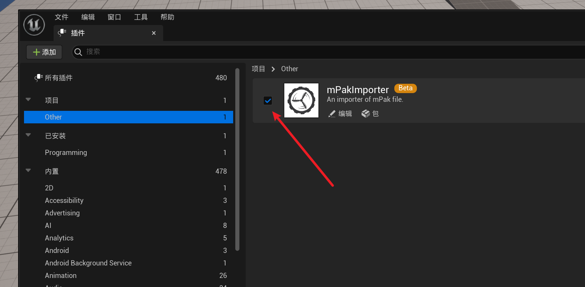
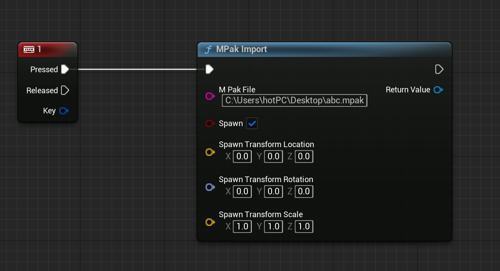

</img>

<h1 align="center" style="font-size:50px;font-weight:bold">mPak</h1>

Multi-platform pak integrated solution

    
     
    

# mPak Usage:
- [-help]         help
- [-output=path]  Save to path		 
- [.pak] [.pak]   Package multiple files into mPak		 
- [file.mpak]     Split the mPak to multiple files

# mPakImporter Usage:
</img>
- Download and enable the mPakImporter
</img>

# original intention of design：
- Reduce the cost of managing resource bundles
- Making Unreal Engine project more flexible and free
- Breaking down the boundaries between developer and user
- Reduce the complexity of functional testing

